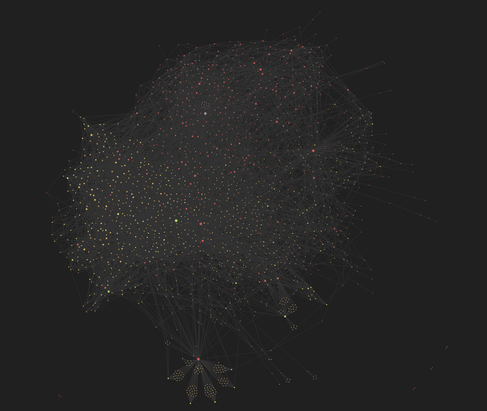

# Rationalia

> 👋 Hello and welcome to your personal guide to [LessWrong](https://lesswrong.com), [The Effective Altruism Forum](https://forum.effectivealtruism.org/), and [The AI Alignment Forum](https://www.alignmentforum.org/).

This repository is a starting point to take notes on the concepts, terms, jargon, and principles you'll find in the rationality/effective altruism space. It was built with [Obsidian](https://obsidian.md) in mind (as a starter template for a new vault or as a drop-in for your existing vault).



## Motivation

LessWrong and its compatriots have accumulated a lot of posts over the years. This can be daunting for newcomers. Sure you can grind through [The Sequences](https://www.lesswrong.com/rationality), but it's going to take a lot more work to actually keep the information in long-term memory.

In particular, the aim of this repository is:

- To get you up to speed with [LessWrong's "concepts"](https://www.lesswrong.com/tags/all), [jargon](https://www.lesswrong.com/tag/lesswrong-jargon), and [canon](https://www.lesswrong.com/tag/lesswrong-canon-on-rationality), as well as with [EA's "topics"](https://forum.effectivealtruism.org/topics/all).[^0]
- To walk you through [LessWrong's](https://www.lesswrong.com/library), [AF's](https://www.alignmentforum.org/library) and [EA's](https://forum.effectivealtruism.org/library) "standard" libraries.

## Structure

This vault consists of note-taking templates that correspond to published posts. These templates are usually pretty bare (you're the one taking the notes).

What you can expect to find is:

- **Metadata** (tags, external links, authors, etc.). Each note also has a `status` set to `todo` by default. You can set it to `in progress` and `done` as you work through the material. (This works well with [Dataview](https://github.com/blacksmithgu/obsidian-dataview) if you want to keep track of your overall progress.)
- Internal (bidirectional) **links**
- When applicable, **definition**(s) and flashcard template(s), for example:

```
%%

% START
Basic (and reversed card)
What is **Absurdity Heuristic**?
Back: Our intuitive tendency to classify very unlikely scenarios as bizarre, even impossible.
Tags: LessWrong
END

%%
```

> NOTE: In order to make a flashcard visible to [Obsidian_to_Anki](https://github.com/Pseudonium/Obsidian_to_Anki), replace `% START` with `START`. (This requires your manual approval because the first rule of SRS is [to understand before you memorize](https://www.supermemo.com/en/archives1990-2015/articles/20rules).)

## How to Start

- [LessWrong](./LW/LessWrong)
- The Effective Altruism Forum (in progress)
- The AI Alignment Forum (in progress)

## Notes

- This vault comes along with a little plugin (tucked away into `.obsidian`) that synchronizes notes. To sync the current note, use the `Rationalia: Sync active note with LW/EA` command.
- Colons, `:` , aren't allowed in filenames, so when they occur in titles, they've been replaced with an endash `—`.
- To disambiguate posts/sequences/concepts that have the same names, I've added `(Post)`, and `(Sequence)` where necessary. (The concept is left alone.)
- "Concepts" have a corresponding page on the LessWrong wiki. "Jargon" items don't, but refer to a common idea or acronym used on the site.

[^0]: Each concept note has one or more flashcard templates that you can use to [autogenerate Anki flashcards](https://github.com/Pseudonium/Obsidian_to_Anki). It's a good idea to [reword the provided definition in your own words](https://www.supermemo.com/#Personalize%20and%20provide%20examples).
