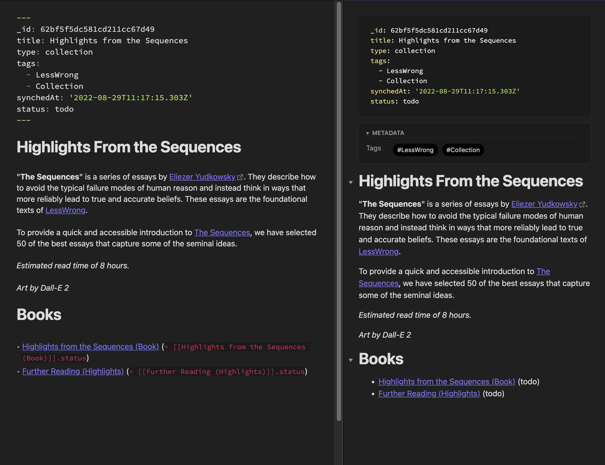

# Rationalia

> 👋 Hello and welcome to your personal guide to [LessWrong](https://lesswrong.com), [The Effective Altruism Forum](https://forum.effectivealtruism.org/), and [The AI Alignment Forum](https://www.alignmentforum.org/).

This repository is a starting point to take notes on the concepts, terms, jargon, and principles you'll find in the rationality/effective altruism space. It was built with [Obsidian](https://obsidian.md) in mind (as a starter template for a new vault or a drop-in for your existing vault).


## Motivation

LessWrong and its compatriots have accumulated a lot of content over the years. This is daunting for newcomers. Simply reading through [The Sequences](https://www.lesswrong.com/rationality) is great, but really internalizing the knowledge & putting it to work will require extra effort.

In particular, the aim of this repository is:

- To get you up to speed with [LessWrong's "concepts"](https://www.lesswrong.com/tags/all), [jargon](https://www.lesswrong.com/tag/lesswrong-jargon), and [canon](https://www.lesswrong.com/tag/lesswrong-canon-on-rationality), as well as with [EA's "topics"](https://forum.effectivealtruism.org/topics/all).[^0]
- To walk you through [LessWrong's](https://www.lesswrong.com/library), [AF's](https://www.alignmentforum.org/library) and [EA's](https://forum.effectivealtruism.org/library) "standard" libraries.

## Structure

This vault consists of note-taking templates that correspond to published posts. These templates are usually pretty bare (you're the one taking the notes).

What you can expect to find is:

- **Metadata** (tags, external links, authors, etc.). Each note also has a `status` set to `todo` by default. You can set it to `in progress` and `done` as you work through the material. (This works well with [Dataview](https://github.com/blacksmithgu/obsidian-dataview) if you want to keep track of your overall progress.)
- Internal (bidirectional) **links**
- When applicable, **definition**(s) and flashcard template(s).

The file structure is as follows (this might change in the future):

```sh
── LW
   │   # Guides to the vault
   ├── Reading Orders
   │   # Content
   ├── Collections
   ├── Books
   ├── Sequences
   ├── Posts
   ├── Other Resources
   │   # Ideas / People / etc.
   ├── Concepts
   ├── Jargon
   ├── People
   └── Organizations

```

## Flashcards

Thanks to [Obsidian_to_Anki](https://github.com/Pseudonium/Obsidian_to_Anki), you can automatically generate flashcards from the concepts and topics in this vault.

```
%%

% START
Basic (and reversed card)
What is **Absurdity Heuristic**?
Back: Our intuitive tendency to classify very unlikely scenarios as bizarre, even impossible.
Tags: LessWrong
END

%%
```

> NOTE: In order to make a flashcard visible to [Obsidian_to_Anki](https://github.com/Pseudonium/Obsidian_to_Anki), replace `% START` with `START` (i.e, remove the `%`). This requires your manual approval because the first rule of SRS is [to understand before you memorize](https://www.supermemo.com/en/archives1990-2015/articles/20rules). It's up to you to decide what you want to learn.

## Tracking Progress

Each concept, post, collection, etc. has a `status` field in its metadata that can take one of three values `todo`, `in progress`, or `done`.

By default, all notes are `todo`. Thanks to [Dataview](https://github.com/blacksmithgu/obsidian-dataview) , we can use this to keep track of progress in a reading order/sequence, so you know exactly where you are:



## How to Start

- [LessWrong](./LW/LessWrong)
- The Effective Altruism Forum (in progress)
- The AI Alignment Forum (in progress)

## Timeline

- Clean up the garbage code I wrote to generate/sync the content in this vault.
- Support for EA, AF, Overcoming Bias, etc.

## Miscellaneous

- This vault comes along with a little plugin (tucked away into `.obsidian`) that synchronizes notes. To sync the current note, use the `Rationalia: Sync active note with LW/EA` command. To sync call notes use the `Rationalia: Sync all notes with LW/EA` command.
- Colons, `:` , aren't allowed in filenames, so when they occur in titles, they've been replaced with an en dash, `—`.
- To disambiguate posts/sequences/concepts that have the same names, note titles may include a `(Post)` or `(Sequence)` where necessary.
- "Concepts" have a corresponding page on the LessWrong wiki. "Jargon" items don't, but refer to a common idea or acronym used on the site.

## Contributing

If you want to contribute, awesome! There's room for everything from fixing tags and links, to sharing your own notes (it may be interesting to have note-takers submit their notes on different branches, so future users have a wide range of inspiration), to radical redesigns. Feel free to [message me on LessWrong](https://www.lesswrong.com/users/jhoogland).

[^0]: Each concept note has one or more flashcard templates that you can use to [reword the provided definition in your own words](https://www.supermemo.com/#Personalize%20and%20provide%20examples). It's a good idea to [autogenerate Anki flashcards](https://github.com/Pseudonium/Obsidian_to_Anki).
